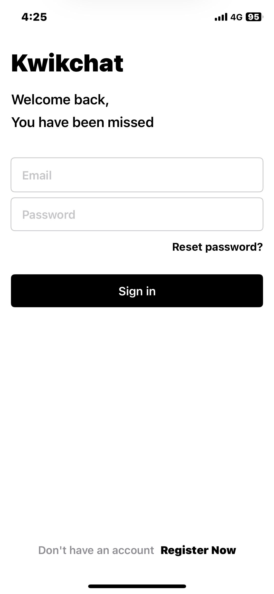

## 📱 KwikChat

A modern social networking app built with SwiftUI and Firebase, enabling real-time communication and content sharing.
<div align="center">
  
  <br>
  
  
  
  
</div>

## ✨ Features

### Current Features
- 🔐 **Secure Authentication**
  - Email & password login/signup
  - Persistent user sessions
  - Profile management

- 📝 **Content Sharing**
  - Post text updates
  - Share images with captions
  - Real-time feed updates

- 👥 **Social Interactions**
  - Like/dislike posts
  - User profile viewing
  - Search functionality for finding users

- 💾 **Data Management**
  - Firebase Realtime Database integration
  - Secure data storage
  - Efficient data retrieval

### 🚀 Upcoming Features
- Direct messaging between users
- Story features
- Post comments
- Enhanced media sharing options
- Push notifications
- User verification badges

## 🛠 Technical Stack

- **Frontend**: SwiftUI
- **Backend**: Firebase
- **Database**: Firebase Realtime Database
- **Storage**: Firebase Cloud Storage
- **Authentication**: Firebase Auth

## 📋 Prerequisites

- Xcode 14.0 or later
- iOS 15.0+ deployment target
- CocoaPods installed
- Firebase account
- Active Apple Developer account (for testing on real devices)

## ⚙️ Installation

1. **Clone the repository**
```bash
git clone https://github.com/AbuzarSiddiqi/KwikChat.git
cd KwikChat
```

2. **Set up Firebase**
   - Create a new Firebase project at [Firebase Console](https://console.firebase.google.com)
   - Add an iOS app to your Firebase project
   - Download the `GoogleService-Info.plist` file
   - Place the file in your Xcode project root directory

3. **Configure Bundle Identifier**
   - Open the project in Xcode
   - Select the project in the navigator
   - Under targets, select your app
   - Change the Bundle Identifier to match your Firebase configuration

4. **Install dependencies**
```bash
pod install
```

5. **Open the workspace**
```bash
open KwikChat.xcworkspace
```

## 🔧 Configuration

### Firebase Setup

1. Go to [Firebase Console](https://console.firebase.google.com)
2. Create a new project
3. Add an iOS app:
   - Register app with your Bundle ID
   - Download GoogleService-Info.plist
   - Add the file to your Xcode project
4. Enable Authentication:
   - Go to Authentication → Sign-in methods
   - Enable Email/Password authentication
5. Set up Firestore Database:
   - Create a new Firestore Database
   - Start in test mode
   - Update rules according to your security needs (allow read, write: if  request.auth != null)
5. Set up Firebase Storage:
   - Create a new Firebase Storage
   - Start in test mode
   - Update rules according to your security needs (allow read, write: if  request.auth != null)
     
### Xcode Configuration

1. Open Xcode preferences
2. Add your Apple Developer account
3. Select your team in the project settings
4. Update the Bundle Identifier
5. Ensure all capabilities are properly configured

## 🚦 Usage

1. Build and run the project in Xcode
2. Create a new account or log in
3. Start posting and interacting with other users
4. Explore the search functionality to find users
5. View profiles and follow interesting users

## 📝 Contributing

1. Fork the repository
2. Create your feature branch (`git checkout -b feature/AmazingFeature`)
3. Commit your changes (`git commit -m 'Add some AmazingFeature'`)
4. Push to the branch (`git push origin feature/AmazingFeature`)
5. Open a Pull Request

## 📄 License

This project is licensed under the MIT License - see the [LICENSE.md](LICENSE.md) file for details

## 👏 Acknowledgments

- Firebase team for their excellent documentation
- SwiftUI community for inspiration and support
- All contributors who help improve this project

## 📞 Contact
Abuzar Siddiqi - abuzar007yt@gmail.com

---

⭐️ Star this repository if you find it helpful!
